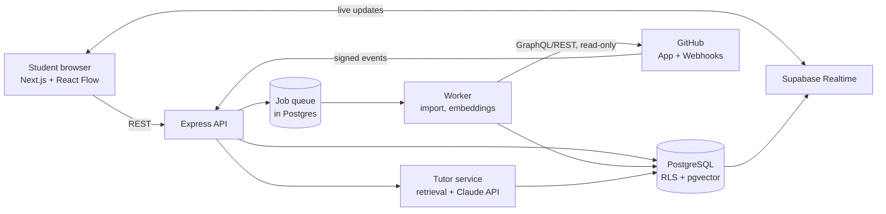

# GitViz

> **🚧 STATUS: IN PROGRESS.** Under active development. The backend foundation is done and the database layer is being built. Most features below are planned and are marked as such.


**GitViz** is an interactive learning platform that helps beginner developers understand Git, GitHub, and CI/CD pipelines by *seeing* them work. Students connect a real GitHub repository and watch its commit history, branches, merges, and workflow runs rendered as live, interactive visualizations. They can then simulate Git operations safely, get terminal errors explained, and (later) ask an AI tutor about advanced concepts.

The problem it solves: many developers use `git branch`, `git push`, and `git pull` without understanding what those commands do to the repository, so the first rebase conflict or rejected push leaves them stuck. GitViz makes the invisible structure visible.

---

## Table of contents

1. [Features](#features)
2. [Tech stack](#tech-stack)
3. [Architecture](#architecture)
4. [Data model](#data-model)
5. [Project structure](#project-structure)
6. [Getting started](#getting-started)
7. [Environment variables](#environment-variables)
8. [Scripts](#scripts)
9. [Testing](#testing)
10. [Security principles](#security-principles)
11. [Roadmap](#roadmap)
12. [Troubleshooting local setup](#troubleshooting-local-setup)
13. [Contributing and license](#contributing-and-license)

---

## Features

Legend: ✅ done · 🔨 in progress · 📋 planned

### Platform foundation
- ✅ Express API with structured logging, security headers, validated configuration, JSON error handling, and graceful shutdown
- ✅ Automated tests with Vitest and Supertest
- 🔨 Local PostgreSQL database with versioned migrations (Supabase CLI + Docker)
- 📋 Authentication (email and GitHub login), user profiles, and roles
- 📋 Row-level security so users can only access their own data

### Repository visualization
- 📋 **Connect a real repository** through a read-only GitHub App (private repositories supported)
- 📋 **Interactive commit graph**: commits, parent links, branches, HEAD, merge commits, zoom, pan, filters, and a mini-map
- 📋 **Commit inspector**: author, date, parents, branch membership, and per-file changes with additions and deletions
- 📋 **Branch comparison and merge visualizer**: merge-base, divergence, and the commits unique to each branch
- 📋 **Commit search and file history**
- 📋 **Repository insights**: contributors, activity over time, and churn

### Real-time updates
- 📋 GitHub webhooks (push, pull request, workflow run) flow through a queue into the database and out to the browser via Supabase Realtime, so the graph and CI pipeline animate when something happens in the real repository
- 📋 Signature-verified, idempotent webhook processing

### Simulation and learning
- 📋 **Dry-run Git simulator** for branch, merge, rebase, reset, and cherry-pick. It runs on a copy of the imported graph and **never writes to the user's repository**
- 📋 **CI/CD pipeline visualization** driven by real GitHub Actions runs
- 📋 **Guided lessons and challenges** with hints and state validation
- 📋 **Advanced GitHub concepts**: pull requests and review flow, merge vs squash vs rebase, branch protection, CODEOWNERS, forks, GitHub Actions (triggers, matrices, secrets, caching), tags and releases, and recovery tools (reflog, interactive rebase, bisect)
- 📋 **Progress tracking**: lesson progress, learning streaks, and achievement badges

### Terminal error troubleshooter
- 📋 Paste a terminal message (a rebase conflict, a rejected push, a detached HEAD) and get what happened, why, and the exact fix commands in order
- 📋 A tested catalog of known Git and GitHub errors answers most cases deterministically (for example `! [rejected] main -> main (non-fast-forward)`, `CONFLICT (content)`, `detached HEAD`, `Permission denied (publickey)`)
- 📋 Each fix command carries a safety rating (for example `push --force` is flagged and `--force-with-lease` suggested)
- 📋 The explanation can load a simulator scenario that reproduces the broken state, or highlight the problem in the student's own repository graph
- 📋 Secrets and personal paths are redacted before anything is stored; pasted text is treated as untrusted data
- 📋 Unknown errors fall back to the AI tutor

### AI tutor (text only)
- 📋 Tutor mode that explains advanced concepts in text with **retrieval-augmented generation (RAG)**
- 📋 Answers cite the lesson sections they came from
- 📋 Automated re-embedding when lesson content or a connected repository's workflow files change
- 📋 Per-user rate limits and a small evaluation set to measure answer quality

---

## Tech stack

| Layer | Technology | Purpose |
|---|---|---|
| Runtime | **Node.js 20+** (ES modules) | Backend runtime |
| API | **Express 5** | HTTP API; async errors reach the error middleware automatically |
| Validation | **Zod** | Environment and request validation |
| Logging | **Pino** + pino-http (pino-pretty in development) | Structured, fast logs |
| Security middleware | **Helmet**, **CORS** | Security headers and origin control |
| Database | **PostgreSQL 17** via **Supabase** | Primary data store |
| Vector search | **pgvector** | Embeddings storage for the tutor |
| Text search | **pg_trgm** | Fast commit and file search |
| Auth | **Supabase Auth** | Accounts, sessions, GitHub login |
| Authorization | **Row-level security (RLS)** | Per-user data access enforced in the database |
| Realtime | **Supabase Realtime** | Push live updates to the browser |
| Local development | **Docker** + **Supabase CLI** | Full local stack, resettable in seconds |
| Migrations | Plain SQL files in `supabase/migrations/` | Versioned, repeatable schema |
| Git data | **GitHub App**, GitHub GraphQL and REST APIs, **isomorphic-git** | Repository ingestion without cloning untrusted code |
| Background jobs | Separate Node worker with a Postgres-backed queue | Imports, embedding jobs, retries |
| Frontend (planned) | **Next.js** (App Router), **TypeScript**, **Tailwind CSS**, **shadcn/ui** | Application UI |
| Visualization (planned) | **React Flow** and/or **D3.js** | Commit graph and DAG rendering |
| AI tutor (planned) | **Claude API** + **RAG** over pgvector | Text-based concept explanations with citations |
| Testing | **Vitest**, **Supertest**; **Playwright** planned for end-to-end | Unit, API, and E2E tests |
| Deployment (planned) | Hosted Supabase, a container host for the API and worker, Vercel for the frontend | Production |

---

## Architecture



**How the main flow works**

1. A user signs in and connects a repository by installing the read-only GitHub App on it.
2. The API validates the request and creates an import job in the queue.
3. The worker reads commit history (commits and parent links), branches, and workflow runs from GitHub and stores them in Postgres. File-level detail is fetched lazily.
4. The graph engine, a pure and fully tested module, computes ordering, ancestors and descendants, merge-bases, divergence, and lane layout.
5. The frontend loads a window of the graph and renders it. Webhooks from GitHub update the database, and Realtime pushes the change to the browser.
6. The simulator runs operations on an in-memory copy of the graph. Nothing is ever written back to GitHub.

---

## Data model

Initial schema (grows migration by migration):

| Table | Purpose | Status |
|---|---|---|
| `profiles` | One row per user: display name, avatar, role (`student` or `admin`); created automatically on signup | 🔨 |
| `repositories` | Connected repositories and their sync status | 📋 |
| `branches` | Branch names and head commits | 📋 |
| `commits` | Commit metadata keyed by SHA | 📋 |
| `commit_edges` | Parent and child links forming the DAG | 📋 |
| `commit_files` | Per-file change statistics for the inspector | 📋 |
| `import_jobs` | Import and sync job status, retries, and error logs | 📋 |
| `lessons`, `challenges`, `progress`, `achievements`, `streaks` | Learning content and user progress | 📋 |
| `error_patterns`, `error_explanations`, `troubleshoot_sessions` | Terminal error troubleshooter | 📋 |
| `tutor_chunks` (embeddings), `tutor_conversations` | RAG corpus and chat history | 📋 |

All user-owned tables use row-level security. Users cannot change their own role: only `display_name` and `avatar_url` are updatable by the `authenticated` role.

---

## Project structure

```
gitviz/
├── backend/                 Express API (Node 20+, ES modules)
│   ├── src/
│   │   ├── index.js         Starts the server, handles graceful shutdown
│   │   ├── app.js           createApp(): middleware and routes (no listen, so it is testable)
│   │   ├── config/env.js    Zod-validated environment variables
│   │   ├── lib/logger.js    Pino logger
│   │   ├── middleware/errors.js   404 and error handling
│   │   └── routes/health.js       GET /api/health
│   ├── tests/               Vitest + Supertest
│   ├── vitest.config.js
│   ├── .env.example
│   └── package.json
├── supabase/                Local Supabase config and SQL migrations
│   └── migrations/
├── frontend/                Next.js app (planned)
└── README.md
```

---

## Getting started

These steps are written for **Windows + PowerShell**. They also work on macOS and Linux with equivalent commands.

### Prerequisites

- **Node.js 20 or newer** (`node -v`)
- **Git**
- **Docker Desktop**, running (virtualization or WSL2 enabled on Windows)
- Do not keep the project inside a OneDrive-synced folder. Use a path such as `C:\dev\gitviz`

### 1. Clone and install

```powershell
git clone <your-repo-url> gitviz
cd gitviz\backend
npm install
```

### 2. Configure environment

```powershell
copy .env.example .env
```

### 3. Start the local database

From the **project root**:

```powershell
npx supabase start
```

The first run downloads several GB of Docker images. When it finishes it prints local URLs, including **Studio** (database dashboard) at `http://127.0.0.1:54323` and **Mailpit** (a fake inbox for auth emails) at `http://127.0.0.1:54324`.

Build the schema from the migration files:

```powershell
npx supabase db reset
```

### 4. Run the API

```powershell
cd backend
npm run dev
```

Open `http://localhost:3000/api/health`. You should see `{"status":"ok", ...}`.

### Everyday commands

```powershell
npx supabase status      # reprint local URLs and keys
npx supabase stop        # shut the local database down
npx supabase db reset    # rebuild the database from migrations
npx supabase migration new <name>   # create a new migration file
```

---

## Environment variables

`backend/.env` (validated at startup; the server refuses to start on invalid values):

| Variable | Default | Description |
|---|---|---|
| `NODE_ENV` | `development` | `development`, `test`, or `production` |
| `PORT` | `3000` | API port |
| `LOG_LEVEL` | `info` | `fatal` to `trace`, or `silent` |

More will be added as features land (Supabase URL and keys, GitHub App credentials, webhook secret, AI API key). **Never commit real secrets.** The local Supabase keys printed by `supabase start` are shared development defaults, but hosted-project keys and the secret key must stay out of git and out of the frontend.

---

## Scripts

Run from `backend/`:

| Script | Command | Description |
|---|---|---|
| `npm run dev` | `node --watch src/index.js` | Start the API with auto-restart |
| `npm start` | `node src/index.js` | Start the API |
| `npm test` | `vitest run` | Run the test suite once |

---

## Testing

- **Unit tests** for pure logic (the graph engine, the simulator state model, the error matcher) with fixtures for every case
- **API tests** with Supertest against `createApp()`, no network port needed
- **Database tests** for RLS policies against the local Supabase instance
- **End-to-end tests** with Playwright once the frontend exists

---

## Security principles

- **Read-only GitHub access.** The GitHub App requests only Contents, Metadata, Pull requests, Actions, and Checks read permissions, and users choose exactly which repositories to share.
- **Dry-run only.** The simulator never writes to a connected repository, and user-provided Git commands are never executed on the server.
- **No cloning of untrusted code.** Imports use the GitHub API, with limits on repository size, commit count, processing time, and concurrent jobs.
- **Authorization in the database.** Row-level security protects private data even if an API route has a bug.
- **Verified webhooks.** Signatures are checked against the raw request body; deliveries are idempotent.
- **Untrusted input.** Pasted terminal output is redacted and never treated as instructions, including when it reaches the AI tutor.
- **Secrets management.** Server-side keys stay in protected environments only.

---

## Roadmap

- [x] **Step 1: Foundation.** Express app structure, validated config, logging, error handling, tests
- [ ] **Step 2: Database foundation** 🔨. Local Supabase via Docker, `pgvector` and `pg_trgm`, `profiles` with RLS and signup trigger
- [ ] **Step 3: Auth.** Email and GitHub login, backend token verification, roles
- [ ] **Step 4: Graph engine.** Topological order, ancestors and descendants, merge-base, divergence, lane layout
- [ ] **Step 5: GitHub App connection.** Install flow and repository linking
- [ ] **Step 6: Import pipeline and worker.** Queue, retries, limits, status tracking
- [ ] **Step 7: Webhooks and realtime.** Live graph and CI updates
- [ ] **Step 8: Read APIs.** Graph window, inspector, compare, search, file history, insights
- [ ] **Step 9: Dry-run simulator** on real repository graphs
- [ ] **Step 10: Lessons and concepts engine, plus the terminal error troubleshooter**
- [ ] **Step 11: AI tutor with RAG**
- [ ] **Step 12: Hardening and deployment.** Rate limiting, load tests, observability, CI/CD
- [ ] **Frontend** (built alongside the backend): dashboard, commit graph, inspector, simulator, learning pages

---

## Troubleshooting local setup

| Problem | Likely cause and fix |
|---|---|
| `Cannot connect to the Docker daemon` | Docker Desktop is not fully started. Wait for "Engine running". |
| A port is already in use | Another Postgres or service is running. Stop it, or change the ports in `supabase/config.toml`. |
| `No test files found` | Test files must be named `*.test.js` and saved inside the project. |
| `Invalid environment` on startup | A value in `.env` fails validation. The message lists which one. |
| Warning about analytics on Windows | Harmless. It only affects the optional log analytics feature. |
| Very slow first `supabase start` | Normal. It is downloading images once. |

---

## Contributing and license

This is a personal portfolio project and is not yet open to contributions. A license will be added before the first public release.
